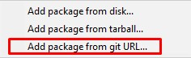

# Mdx Importer

Mdx/Mdl to Unity importer.

- [x] Geometry
- [x] Materials
- [ ] Textures
- [ ] Bones
- [ ] Animations

## Installation

1. Open the Package Manager.
2. Press the plus button and select "Add package from git URL...".

3. Copy and paste the git repository URL.
