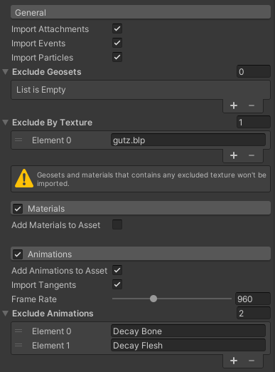

# MDX Importer

MDX/MDL to Unity importer.

## Features

- [x] Geometry
- [x] Materials (Built-in shader support)
- [ ] Textures
- [x] Skeleton
- [x] Animations
- [x] Attachments
- [x] Events
- [x] Particle Emitters
- [x] Collision Shapes

## Settings

* Import attachments.
* Import events.
* Import particle emitters.
* Import collission shapes.
* Exclude geosets by ID.
* Exclude geosets and materials by texture name.
* Import materials independent from the asset.
* Import animations independent from the asset.
* Import tangents.
* Set the frame rate.
* Exclude animations by name.